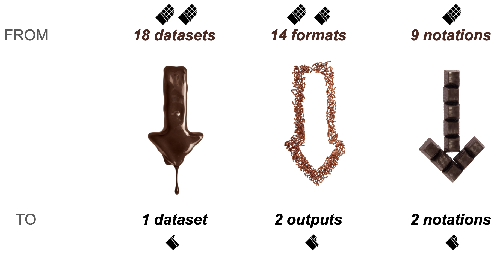
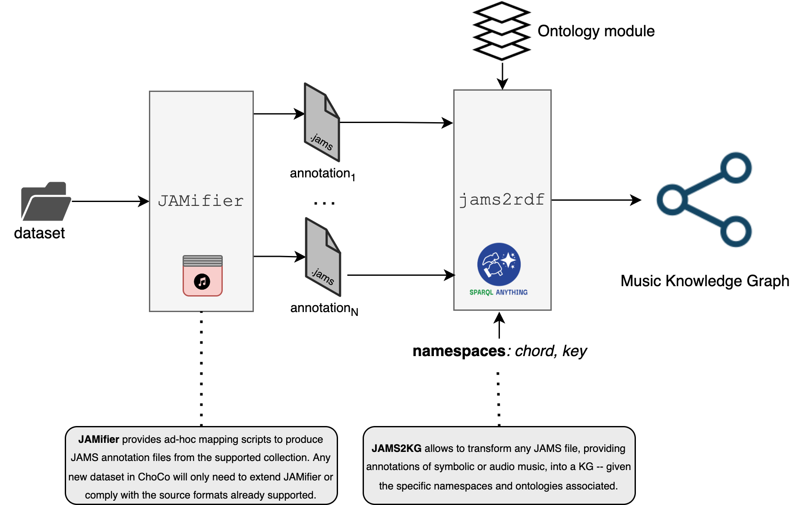
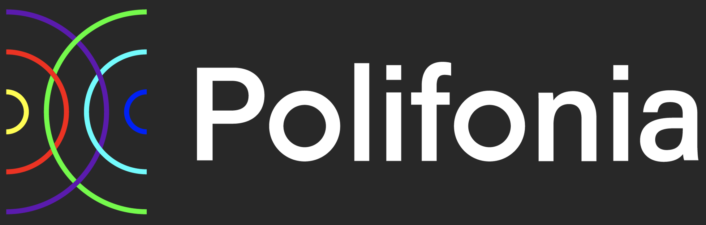

<p align="left">

</p>

# ChoCo: the Chord Corpus

ChoCo provides 20K+ timed chord annotations of scores and tracks, that were integrated, standardised, and semantically enriched from a number of repositories and databases, for a variety of genres and styles (see [overview](#overview)).
The harmonic annotations in ChoCo are released in 2 different formats:
- As a [JAMS](https://jams.readthedocs.io) dataset, where audio and score annotations are distinguished by the `type` attribute in their `Sandbox`; and temporal/metrical information is expressed in seconds (for audio) and measure:beat (for scores);
- As a Knowledge Graph, based on our [JAMS ontology](https://github.com/polifonia-project/jams-ontology) to model music annotations, and on the [Chord](https://motools.sourceforge.net/chord_draft_1/chord.html) and [Roman](https://github.com/polifonia-project/roman-chord-ontology) ontologies to semantically describe chords; a SPARQL endpoint is available at [this link](https://polifonia.disi.unibo.it/choco/).

<p align="center">

</p>

To achieve consistency across annotations, chords are casted to the following 2 notational families: (i) [Harte](https://ismir2005.ismir.net/proceedings/1080.pdf), generalising Leadsheet-based notations and extensively used in music information retrieval systems; (ii) [Roman numerals](https://en.wikipedia.org/wiki/Roman_numeral_analysis), a well-known notation standard where chords are named according to their degree. In addition, to achieve interopability, Roman numeral chords are syntactically converted to the Harte notation. This implies that a corresponding Harte annotation is always available for all tracks/pieces in ChoCo.

The resulting annotations are rich in provenance data, including metadata of the annotated work or track, authors of the annotations, identifiers, and links, etc. We emphasise that the current version of ChoCo only includes high-quality timed chord annotations that were produced by **human** annotators (e.g. music experts, students), or crowdsourced and verified before publication.

ChoCo also comes with a family of tools for chord parsing and manipulation (*tutorial coming soon!*), together with a data transformation pipeline (a [Smashub](https://smashub.github.io) instance) to include new chord datasets in ChoCo.

## How to use ChoCo

### Option 1: using JAMS files

If you are using the ChoCo as a JAMS dataset and you are using Python, you only need to make sure tha the `jams` library is installed in your system.
```python
pip install jams
```
After downloading a [release](https://github.com/smashub/choco/releases) of ChoCo, you can read, manipulate, and edit harmonic annotations via the `jams` library (more info at this [link](https://jams.readthedocs.io/en/stable/).
```python
import jams

# Loading a JAMS file providing chords for "Michelle" by "The Beatles"
audio_jams = jams.load("path_to_choco/jams/isophonics_170.jams")
# Retrieving the first chord annotation (a progression) from the JAMS file
chord_ann = audio_jams.annotations.search(namespace="chord")[0]
# Printing the first 10 chords in the annotation/progression
print(chord_ann.data[:10])
```
Which produces the following output.
```
[Observation(time=0.0, duration=0.421247, value='N', confidence=1.0),
 Observation(time=0.421247, duration=0.994128, value='F:min/5', confidence=1.0),
 Observation(time=1.415375, duration=0.959432, value='E:aug', confidence=1.0),
 Observation(time=2.374807, duration=1.010068, value='F:min7', confidence=1.0),
 Observation(time=3.384875, duration=0.986848, value='F:min6/5', confidence=1.0),
 Observation(time=4.371723, duration=1.085346, value='C#:maj7/3', confidence=1.0),
 Observation(time=5.457069, duration=0.459543, value='Bb:min/5', confidence=1.0),
 Observation(time=5.916612, duration=0.521956, value='C#/3', confidence=1.0),
 Observation(time=6.438568, duration=2.031476, value='C', confidence=1.0),
 Observation(time=8.470045, duration=2.101406, value='F', confidence=1.0)]
 ```

### Option 2: using the RDF files

Another option is to work on ChoCo's Knowledge Graph and use the RDF files in the release folder; or simply query our [SPARQL endpoint](https://polifonia.disi.unibo.it/choco/sparql). For example, the output of the Python snippet above can be obtained with a SPARQL query to the endpoint (see the query below), which returns [this output](https://polifonia.disi.unibo.it/choco/query#query=PREFIX%20rdf%3A%20%3Chttp%3A%2F%2Fwww.w3.org%2F1999%2F02%2F22-rdf-syntax-ns%23%3E%0APREFIX%20rdfs%3A%20%3Chttp%3A%2F%2Fwww.w3.org%2F2000%2F01%2Frdf-schema%23%3E%0APREFIX%20jams%3A%20%3Chttp%3A%2F%2Fw3id.org%2Fpolifonia%2Fontology%2Fjams%2F%3E%0APREFIX%20mm%3A%20%3Chttp%3A%2F%2Fw3id.org%2Fpolifonia%2Fontology%2Fmusic-entity%2F%3E%0APREFIX%20core%3A%20%3Chttp%3A%2F%2Fw3id.org%2Fpolifonia%2Fontology%2Fcore%2F%3E%0A%0ASELECT%20DISTINCT%20%3FobservationValue%20%3FstartTime%20%3FstartTimeType%20%3Fduration%20%3FdurationType%0AWHERE%20%7B%0A%20%20%3Fmusicentity%20a%20mm%3AMusicEntity%20%3B%0A%20%20%20%20core%3Atitle%20%22Michelle%22%20%3B%0A%20%20%20%20jams%3AhasJAMSAnnotation%20%3Fannotation%20.%0A%20%20%3Fannotation%20jams%3AincludesObservation%20%3Fobservation%20%3B%0A%20%20%20%20jams%3AhasAnnotationType%20%22chord%22%20.%0A%20%20%3Fobservation%20rdfs%3Alabel%20%3FobservationValue%20%3B%0A%20%20%20%20jams%3AhasMusicTimeInterval%20%5Bjams%3AhasMusicTimeDuration%20%5B%20jams%3AhasValue%20%3Fduration%20%3B%20jams%3AhasValueType%20%3FdurationType%20%5D%20%3B%0A%20%20%20%20%20%20jams%3AhasMusicTimeStartIndex%20%5B%20jams%3AhasMusicTimeIndexComponent%20%5B%20jams%3AhasValue%20%3FstartTime%20%3B%20jams%3AhasValueType%20%3FstartTimeType%20%20%5D%5D%5D%20.%0A%7D%0AORDER%20BY%20(%3FstartTime)%0ALIMIT%2010&endpoint=https%3A%2F%2Fpolifonia.disi.unibo.it%2Fsemanticroman%2Fsparql&requestMethod=POST&tabTitle=Query&headers=%7B%7D&contentTypeConstruct=application%2Fn-triples%2C*%2F*%3Bq%3D0.9&contentTypeSelect=application%2Fsparql-results%2Bjson%2C*%2F*%3Bq%3D0.9&outputFormat=table) (the first 10 chords of Michelle, ordered by onset).

```sparql
PREFIX rdf: <http://www.w3.org/1999/02/22-rdf-syntax-ns#>
PREFIX rdfs: <http://www.w3.org/2000/01/rdf-schema#>
PREFIX jams: <http://w3id.org/polifonia/ontology/jams/>
PREFIX mm: <http://w3id.org/polifonia/ontology/music-meta/>
PREFIX core: <http://w3id.org/polifonia/ontology/core/>

SELECT DISTINCT ?observationValue ?startTime ?startTimeType ?duration ?durationType
WHERE {
  ?musicentity a mm:MusicEntity ;
    core:title "Michelle" ;
    jams:hasJAMSAnnotation ?annotation .
  ?annotation jams:includesObservation ?observation ;
    jams:hasAnnotationType "chord" .
  ?observation rdfs:label ?observationValue ;
    jams:hasMusicTimeInterval [jams:hasMusicTimeDuration [ jams:hasValue ?duration ; jams:hasValueType ?durationType ] ;
      jams:hasMusicTimeStartIndex [ jams:hasMusicTimeIndexComponent [ jams:hasValue ?startTime ; jams:hasValueType ?startTimeType  ]]] .
}
ORDER BY (?startTime)
LIMIT 10
```

## <a name="overview"></a> Overview

The current version of ChoCo contains 20,080 JAMS files: 2,283 from the audio partitions, and 17,803 collected from symbolic music.
In turn, these JAMS files provide 60263 different annotations: 20,530 chord annotations in the Harte notation, and 20,029 annotations of tonality and modulations -- hence spanning both local and global keys, when available.
Besides the harmonic content, ChoCo also provides 554 structural annotations (structural segmentations related to music form) and 286 beat annotations (temporal onsets of beats) for the audio partitions.

| **Partition**        | **Type** | **Notation**  | **Original format** | **Annotations**  | **Genres** |  **References**  |
|----------------------|----------|---------------|---------------------|------------------|------------|:----------------:|
| Isophonics           | A        | Harte         | LAB                 | 300              | pop, rock  |        [1]       |
| JAAH                 | A        | Harte         | JSON                | 113              | jazz       |        [2]       |
| Schubert-Winterreise | A, S     | Harte         | csv                 | 25 (S), 25*9 (A) | classical  |        [3]       |
| Billboard            | A        | Harte         | LAB, txt            | 890 (740)        | pop        |        [4]       |
| Chordify             | A        | Harte         | JAMS                | 50*4             | pop        |        [5]       |
| Robbie Williams      | A        | Harte         | LAB, txt            | 61               | pop        |        [6]       |
| The Real Book        | S        | Harte         | LAB                 | 2486             | jazz       |        [7]       |
| Uspop 2002           | A        | Harte         | LAB                 | 195              | pop        |        [8]       |
| RWC-Pop              | A        | Harte         | LAB                 | 100              | pop        |        [9]       |
| Weimar Jazz Database | A        | Leadsheet     | SQL                 | 456              | jazz       |       [10]       |
| Wikifonia            | S        | Leadsheet     | mxl                 | 6500+            | various    |       [11]       |
| iReal Pro            | S        | Leadsheet     | iReal               | 2000+            | various    |       [12]       |
| Band-in-a-Box        | S        | Leadsheet     | mgu, sku            | 5000+            | various    |       [13]       |
| When in Rome         | S        | Roman         | RomanText           | 450              | classical  |       [14]       |
| Rock Corpus          | S        | Roman         | har                 | 200              | rock       |       [15]       |
| Mozart Piano Sonata  | S        | Roman         | DCMLab              | 54 (18)          | classical  |       [16]       |
| Jazz Corpus          | S        | Hybrid        | txt                 | 76               | jazz       |       [17]       |
| Nottingham           | S        | ABC           | ABC                 | 1000+            | folk       |       [18]       |

The average duration of the annotated music pieces is $191.29 \pm 85.04$ seconds for (audio) tracks, and $135.02 \pm 162.27$ measures for symbolic music.
This provides a heterogeneous corpus with a large extent of variability in the duration of pieces, which also confirms the diversity of musical genres in ChoCo.
Additional statistics can be found from [this](https://github.com/smashub/choco/blob/main/notebooks/dataset_stats.ipynb) Jupyter notebook.


## Transformation workflow

<p align="center">

</p>

**Step 1: Jamification**
>🧩 Achieving interoperability among annotation standards.

Considering the diversity of annotation formats and conventions for data organisation (the way content is scattered across folders, files, database tables, etc.), each chord dataset in ChoCo undergoes a standardisation process finalised to the creation of a JAMS dataset.
This is needed to aggregate all relevant annotations of a piece (chord, keys, etc.) in a single JAMS file, and to extract content metadata from relevant sources.


**Step 2: Conversion**
>🔓 Achieving interoperability among chord notations.

The Chonverter module performs two central tasks to enable the interoperability of datasets at the chord level: (i) casting dataset-specific (often niche) chord notations to their reference notation family (either Leadsheet/Harte, Roman numerals, pitched chords); (ii) conversion to Harte.
This allows processing all chord annotations in ChoCo under the same language.

**Step 3: Knowledge Graph creation**.
>🔗 Releasing musical knowledge that can be linked to other resources on the Web.

Finally, two key components of Smashub are used to generate a Musical Knowledge Graph from the standardised and enriched JAMS files: (i) the [JAMS ontology](https://github.com/polifonia-project/jams-ontology), together with namespace-specific ontologies that can semantically describe the actual content of chord progressions, according to ChoCo's notations -- [Harte](https://motools.sourceforge.net/chord_draft_1/chord.html) and [Roman](https://github.com/polifonia-project/roman-chord-ontology); (ii) the `jams2rdf` Python module, that implement the aforementioned process via [SPARQL Anything](https://github.com/SPARQL-Anything/sparql.anything), a state of the art tool for Semantic Web re-engineering.


## Install

### Option 1: Local Install

If you want to use ChoCo as a Python library in projects, first clone the repository and install the requirements through conda or pip. This may take a while, as the repository currently contains the original raw partitions for reproducibility. Also, some users encountered naming issues in the Wikifonia partition on Windows systems. If you find any issue in the codebase, please open an issue.
```
git clone https://github.com/smashub/choco.git
```
In your environment, install the requirements throguh `pip` (in your conda environment).
```
pip install -r requirements.txt
```

### Option 2: Docker Install

ChoCo can be used using the official Docker image. However, the functionality of the Docker image is currently limited to the creation of a customised dataset. 

To use the image, it is necessary to pull from DockerHub:

```bash
docker pull andreamust/choco:latest
```

To create the bespoke dataset, simply launch a Docker container:

```bash
docker run -it -v "<output_path>:/app/data" -e INCLUDE="" -e EXCLUDE="" -e JAMS_VERSION="" -e WORKERS=1
```

The container exposes a bind mount (`<output_path>`) in which the generated dataset and its metadata are saved. The bind mount must be specified using an absolute path on your system.
The other parameters are defined as follows:
- `INCLUDE`: the name of the ChoCo datasets to include in the custom dataset (to be left blank if `EXCLUDE` is specified);
- `EXCLUDE`: the name of the ChoCo datasets to exclude in the custom dataset (to be left blank if `INCLUDE` is specified);
- `JAMS_VERSION`: the type of JAMS files to be added to the custom dataset (either "original" or "converted");
- `WORKERS`: number of CPU cores to be used in the data processing (default 1).


## Contributing

We are more than happy to extend ChoCo with your annotations/datasets. To contribute, make sure that your workflow is consistent with ChoCo's transformation pipeline and submit a pull request when you are ready. Please send us an email for questions if you have questions on our code of conduct, of if the process for submitting pull requests is unclear.

Our versioning strategy follows a `X.Y.Z` convention where: `Z` is used for minor revisions and improvements; `Y` increments whenever major changes are made (e.g. annotation formats and conventions); `X` is used when new data/collections are made available in ChoCo.

## Authors and attribution
[](https://doi.org/10.5281/zenodo.7706751)

* **Jacopo de Berardinis** - [King's College London](https://jonnybluesman.github.io)
* **Andrea Poltronieri** - [Università degli Studi di Bologna](https://andreapoltronieri.org)
* **Albert Meroño-Peñuela** - [King's College London](https://www.albertmeronyo.org)
* **Valentina Presutti** - [Università degli Studi di Bologna](https://www.unibo.it/sitoweb/valentina.presutti)

```
@article{deberardinis2023choco,
  title={ChoCo: a Chord Corpus and a Data Transformation Workflow for Musical Harmony Knowledge Graphs},
  author={de Berardinis, Jacopo and Mero{\~n}o-Pe{\~n}uela, Albert and Poltronieri, Andrea and Presutti, Valentina},
  journal={Scientific Data},
  volume={10},
  number={1},
  pages={641},
  year={2023},
  publisher={Nature}
}
```

## Acknowledgments

We thank all the annotators for contributing to the project. This project is an output of [Polifonia](https://polifonia-project.eu), and has received funding from the European Union’s Horizon 2020 research and innovation programme under grant agreement No 101004746.

<a href="https://polifonia-project.eu"></a>

## License

ChoCo follows a dual licence scheme to comply with the data sharing strategies of the original collections. Data and code are released under the  [Attribution 4.0 International (CC BY 4.0)](https://creativecommons.org/licenses/by/4.0/), with the exception of data derived from *Chordify Annotator Subjectivity Dataset*, *Mozart Piano Sonata*, and *Jazz Audio-Aligned Harmony* data. The latter are released under the [Attribution-NonCommercial-ShareAlike 4.0 International (CC BY-NC-SA 4.0)](https://creativecommons.org/licenses/by-nc-sa/4.0/). Please, contact us if you have any doubt or issue concerning our data release strategy.

---

## References

[1] Mauch, M., Cannam, C., Davies, M., Dixon, S., Harte, C., Kolozali, S., Tidhar, D., Sandler, M.: Omras2 metadata project 2009. In: 12th International Society for Music Information Retrieval Conference. ISMIR

[2] Eremenko, V., Demirel, E., Bozkurt, B., Serra, X.: Jaah: Audio-aligned jazz harmony dataset (Jun 2018), https://doi.org/10.5281/zenodo.1290

[3] Weiß, C., Zalkow, F., Arifi-Müller, V., Müller, M., Koops, H.V., Volk, A., Grohganz, H.G.: Schubert winterreise dataset: A multimodal scenario for music analysis. Journal on Computing and Cultural Heritage (JOCCH) 14(2), 1–18 (2021)

[4] Burgoyne, J.A., Wild, J., Fujinaga, I.: An expert ground truth set for audio chord recognition and music analysis. In: ISMIR. vol. 11, pp. 633–638 (2011)

[5] Koops, H.V., de Haas, W.B., Burgoyne, J.A., Bransen, J., Kent-Muller, A., Volk, A.: Annotator subjectivity in harmony annotations of popular music. Journal of New Music Research 48(3), 232–252 (2019), https://doi.org/10.1080/09298215.2019.1613436

[6] Di Giorgi, B., Zanoni, M., Sarti, A., Tubaro, S.: Automatic chord recognition based on the probabilistic modeling of diatonic modal harmony. In: nDS’13; Proceedings of the 8th International Workshop on Multidimensional Systems. pp. 1–6. VDE (2013)

[7] Mauch, M., Dixon, S., Harte, C., et al.: Discovering chord idioms through beatles and real book songs (2007)

[8] Berenzweig, A., Logan, B., Ellis, D.P., Whitman, B.: A large-scale evaluation of acoustic and subjective music-similarity measures. Computer Music Journal pp. 63–76 (2004)

[9] Goto, M., Hashiguchi, H., Nishimura, T., Oka, R.: Rwc music database: Popular, classical and jazz music databases. In: Ismir. vol. 2, pp. 287–288 (2002)

[10] Pfleiderer, M., Frieler, K., Abeßer, J., Zaddach, W.G., Burkhart, B. (eds.): Inside the Jazzomat - New Perspectives for Jazz Research. Schott Campus (2017)

[11] Wikifonia page on Wikipedia (discountined project) https://en.wikipedia.org/wiki/Wikifonia

[12] iReal Pro public playlists https://www.irealpro.com/main-playlists

[13] De Haas, W.B., Robine, M., Hanna, P., Veltkamp, R.C., Wiering, F.: Comparing approaches to the similarity of musical chord sequences. In: International Sympo- sium on Computer Music Modeling and Retrieval. pp. 242–258. Springer (2010)

[14] Micchi, G., Gotham, M., Giraud, M.: Not all roads lead to rome: Pitch represen- tation and model architecture for automatic harmonic analysis. Transactions of the International Society for Music Information Retrieval (TISMIR) 3(1), 42–54 (2020)

[15] De Clercq, T., Temperley, D.: A corpus analysis of rock harmony. Popular Music 30(1), 47–70 (2011)

[16] Hentschel, J., Neuwirth, M., Rohrmeier, M.: The annotated mozart sonatas: Score, harmony, and cadence. Transactions of the International Society for Music Infor- mation Retrieval 4(1) (2021)

[17] Granroth-Wilding, M., Steedman, M.: A robust parser-interpreter for jazz chord sequences. Journal of New Music Research 43(4), 355–374 (2014)

[18] Nottingham database. https://ifdo.ca/~seymour/nottingham/nottingham.html, accessed: 2022-05-05


